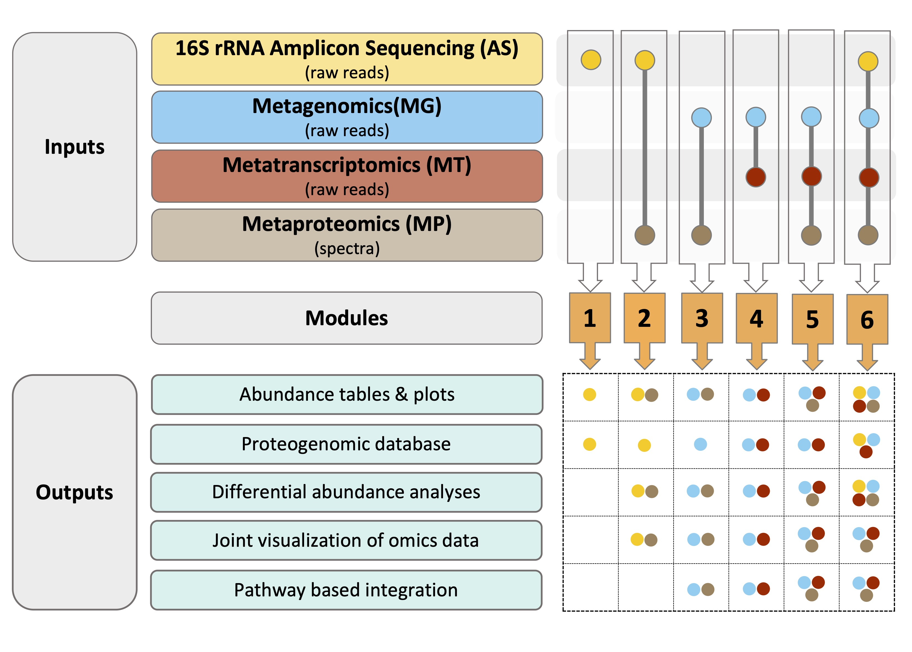

<h1 align="center">gNOMO2</h1>
<h2 align="center">A comprehensive and modular pipeline for integrated multi-omics analyses of microbiomes</h2>

If you use this tool, please cite the preprint:  
  
Arikan M, Muth T. (2023) gNOMO2: a comprehensive and modular pipeline for integrated 
multi-omics analyses of microbiomes. bioRxiv. doi: https://doi.org/10.1101/2023.12.03.569767

# Table of contents
- [Overview](#overview)
- [Requirements](#requirements)
- [Setup](#setup)
    - [Data](#data)
    - [Metadata](#metadata)
    - [Config](#config)
- [Running](#running)
    - [Running locally](#running-locally)
    - [Running on a cluster](#running-on-a-cluster)
- [Outputs](#outputs)
    - [Final outputs](#final-outputs)
    - [Intermediate outputs](#intermediate-outputs)

# Overview
gNOMO2 comprises six modules, each tailored for specific omics data combination (shown below). Module 1 accepts 16S rRNA gene amplicon sequencing (AS) data as input and generates a protein database suitable for metaproteomics studies, a taxa abundance plot and a phyloseq object that can be used for downstream analysis in other microbiome tools. Modules 2 to 6 handle different combinations of AS, metagenomics (MG), metatranscriptomics (MT), and metaproteomics(MP) data, creating omics-specific protein databases, abundance tables, plots, differential abundance analysis results, joint visualization and pathway-level integration analysis results. 



# Requirements
To use gNOMO2, ensure you have `conda` and  `snakemake` installed: 
   
**1. Install conda**: If you do not have conda installed, [install conda](https://conda.io/projects/conda/en/latest/user-guide/install/index.html).  
  
**2. Create a Snakemake environment in conda**:
```
conda create -n snakemake -c bioconda snakemake=7.15.2
```
  

**3. Clone gNOMO2 repository**: If you do not have git installed, [install git](https://github.com/git-guides/install-git).
```
git clone --recursive https://github.com/muzafferarikan/gNOMO2.git
```
  
**Note**: Once conda and snakemake are set up, gNOMO2 manages the installation of all other tools and dependencies automatically in their respective environments during the first run. 

# Setup
## Data
Copy your raw data to the relevant subfolders within the `data` directory:  
* If you have amplicon sequencing data, copy your files to `data/AS/raw`  
* If you have metagenomics data, copy your files to `data/MG/raw`  
* If you have metatranscriptomics data, copy your files to `data/MT/raw`  
* If you have metaproteomics data, copy your files to `data/MP/spectra`.   
  
**Important**: Please check sample format requirements below:  
| Data | Library Layout | Sample Name Format  |
|------|----------------|---------------------|
| AS | PE <br> SE | samplename_1.fastq.gz, samplename_2.fastq.gz <br> samplename_1.fastq.gz |
| MG | PE | samplename_1.fastq.gz, samplename_2.fastq.gz |
| MT |  PE <br> SE | samplename_1.fastq.gz, samplename_2.fastq.gz <br> samplename_1.fastq.gz |
| MP | DDA | samplename.mgf |

## Metadata
gNOMO2 requires a metadata file to perform sample group comparisons. Create a tab delimited metadata file (name it `metadata.txt`) containig information about samples and copy it to the `resources` folder.  

**Important**: 
* The name of the first column in metadata file must be "SampleID"  

## Config
After copying your data and metadata, run the following script from your main gNOMO2 project folder to generate a config file:   
```
bash workflow/scripts/prepare_config.sh
```
This script generates a `config.yaml` file within `config` folder based on contents of `data` directory. Review and modify analysis parameters in this file if you need.

# Running
## Running locally
Once setup is complete, follow these steps to run gNOMO2: 
   
**1. Activate your snakemake environment in conda**:
```
conda activate snakemake
```


**2. Run gNOMO2**:  
Execute the following command from your project folder:
```
snakemake -s workflow/Snakefile --cores 2 --use-conda
```


**Note**: Adjust the `--cores` value to reflect the number of cores available.  

## Running on a cluster
To run gNOMO2 on a cluster:  
  
**1. Configure the cluster settings**:  
Edit the provided `gnomo2_slurm_template.sh` file in the main gNOMO2 folder according to your cluster settings.  


**2. Run gNOMO2**:  
Execute the following command from your home directory in the cluster environemnt:
```
sbatch path/to/gNOMO2/gnomo_slurm_template.sh
```

# Outputs
When gNOMO2 pipeline starts, it generates a `results` folder within your project directory, containing both `final` and `intermediate` outputs.

## Final outputs
The `final` folder includes:  
* Integrated multi-omics analysis results (`integrated`)
    * Differential abundance analysis results for each omics dataset (`diff_abun`)  
    * Joint-visualization results (`combi`) 
    * Pathway level integration results (`pathview`)  
    * A proteogenomic database (`prot_db`)  

* Results for each omics dataset within folders named accordingly (`AS`,`MG`,`MT`,`MP`).
    * Abundance tables
    * Taxonomy tables 
    * Phyloseq objects 
    * Abundance plots 
    
    These files are suitable for further analyses using other microbiome analysis tools. 

## Intermediate outputs
`intermediate` folder contains outputs of each step executed by the gNOMO2 pipeline. 
